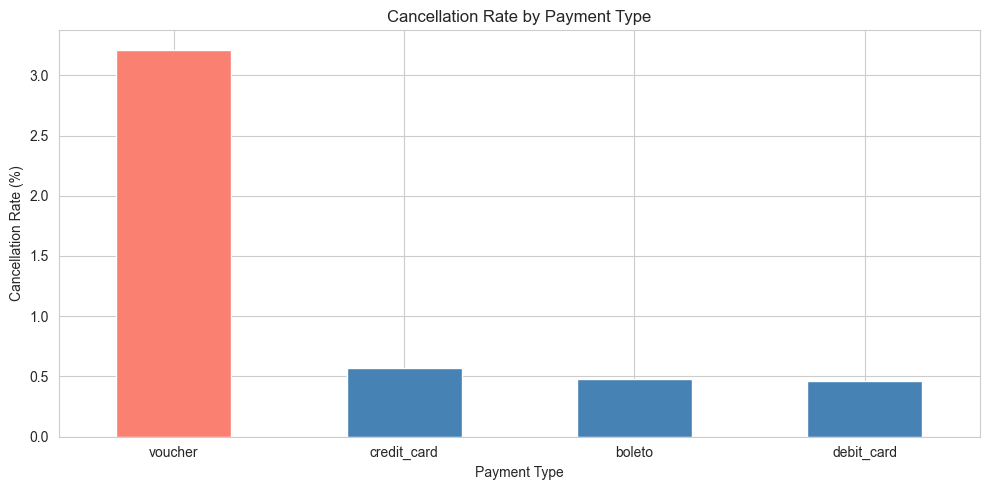
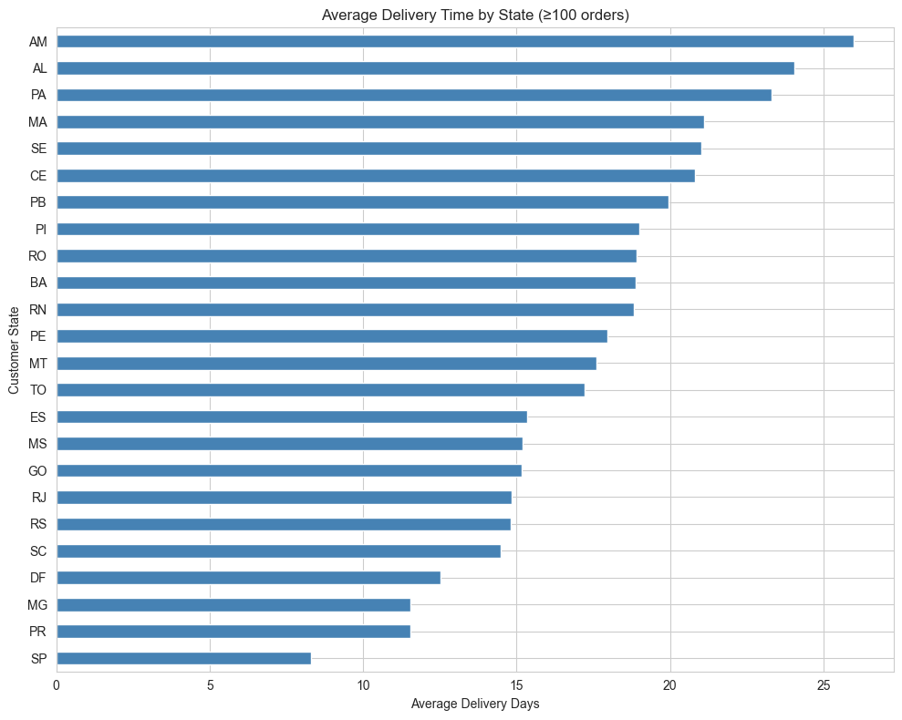
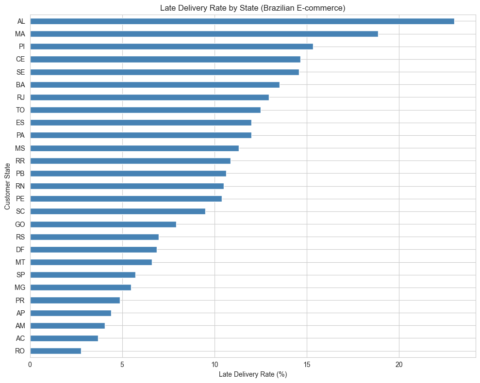
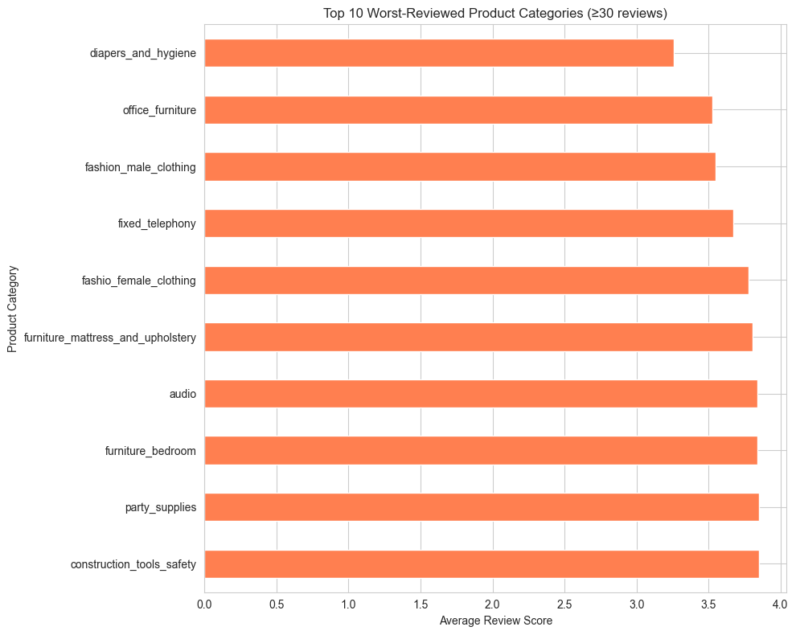

# Olist Brazilian E-Commerce — Exploratory Data Analysis

A data analysis of **99,441 real orders** from Olist, Brazil's largest department-store marketplace, covering 2016–2018.

This project answers four business questions about delivery performance, review quality, regional differences, and cancellation patterns — surfacing actionable findings Olist could investigate further.

---

## 🎯 Key Findings

### 1. Voucher payments cancel ~6× more than other methods

| Payment Type | Cancel Rate | Volume |
|---|---|---|
| **Voucher** | **3.21%** | 2,739 |
| Credit card | 0.57% | 75,387 |
| Boleto | 0.48% | 19,784 |
| Debit card | 0.46% | 1,527 |

The 6× gap is too large to be noise. Plausible drivers: voucher application failures at checkout, promotional impulse leading to second thoughts, or stricter fraud screening. **Actionable:** Olist should audit voucher checkout flows.

---

### 2. The Northeast has a real logistics problem

Brazil's Northeast states (AL, MA, SE, CE, PI, BA, PE) appear in both the slowest deliveries *and* the highest late rates — failing on both metrics simultaneously.

By contrast, remote Northern states (RO, AC, AM, AP) deliver slowly in absolute terms but stay on-time relative to expectations:

> **AM:** 26 days delivery, only **4% late**
> **AL:** 24 days delivery, **23% late**

Same speed, very different "late" rates — because Olist's estimated delivery dates are padded for the remote North but not the Northeast.

---

### 3. Late delivery rate ranges 8× across states

The overall late rate is **7.6%**, but it varies from 2.8% (Rondônia) to 23.0% (Alagoas) — an 8× spread.

---

### 4. Reviews split sharply by product type

After filtering to categories with ≥30 reviews:

- **Top performers** are predictable, standardized items: books (general, imported, technical), flowers, food, luggage — all averaging 4.2–4.4 / 5.
- **Bottom performers** are items where size, fit, condition, or assembly matters: diapers, office furniture, fashion clothing, audio, mattresses — averaging 3.2–3.8 / 5.

The pattern: customer expectations diverge from reality more for items where physical fit or condition matters most.

---

## 📂 Project Structure

olist-ecommerce-eda/
├── notebooks/
│   └── 01_eda.ipynb       ← the full analysis
├── data/                   ← Olist CSVs (not committed; see below)
├── *.png                   ← charts referenced in this README
├── .gitignore
└── README.md

## 🛠️ Tech Stack

- **Python 3.12** · pandas · numpy · matplotlib · seaborn
- **Jupyter Notebook** for interactive analysis
- Standard EDA workflow: load → merge → clean → engineer features → groupby + aggregate → visualize → interpret

## 🔁 How to Reproduce

1. Clone this repo: `git clone https://github.com/ZakkiShah5/olist-ecommerce-eda.git`
2. Download the Olist dataset from [Kaggle](https://www.kaggle.com/datasets/olistbr/brazilian-ecommerce) (9 CSV files).
3. Place all CSVs in a `data/` folder at the project root.
4. Install dependencies: `pip install pandas numpy matplotlib seaborn jupyter`
5. Open `notebooks/01_eda.ipynb` and run all cells.

## 📊 Methodology Notes

- **Joins:** all 9 tables merged into one master DataFrame using left joins on shared IDs (`order_id`, `customer_id`, `product_id`, `seller_id`).
- **Deduplication:** for any per-order metric, used `drop_duplicates(subset='order_id')` to avoid biasing rates by orders with multiple items.
- **Sample size guards:** filtered out groups with too few observations before reporting averages (≥30 reviews per category, ≥100 orders per state, ≥100 orders per payment type).
- **Date handling:** all date columns explicitly converted with `pd.to_datetime()`. "Late" defined as `actual_delivery > estimated_delivery`.

## 🔭 Limitations & Future Work

- **Order value** is computed using the first item's price per order (post-dedup). A more rigorous version would aggregate item prices per order before deduping.
- **"Canceled"** status is narrow — likely excludes orders that are functionally cancellations (e.g., status `unavailable` or never delivered).
- **Single year of data** for monthly cancellation analysis limits seasonal confidence.
- **Next steps I'd take with more time:** seller-level performance analysis, sum-based order value, multi-year seasonality, cluster analysis on review-comment text.

## 👤 About

Built by **Zakee Ul Hassan** as part of a 4-week portfolio sprint transitioning from web development to Data Science. MSc Mathematics candidate at the Federal University of Santa Maria (UFSM), focused on time series forecasting with GLARMA and machine learning.

📫 [LinkedIn](https://www.linkedin.com/in/zakeeulhassan) · zakki5shah@gmail.com